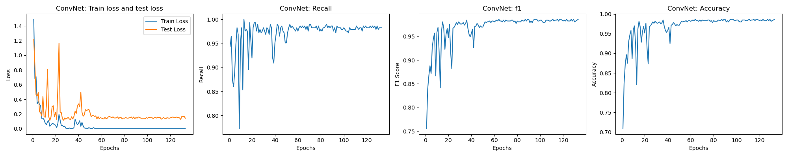
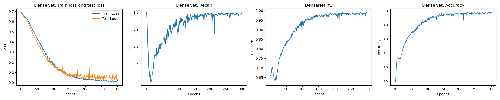
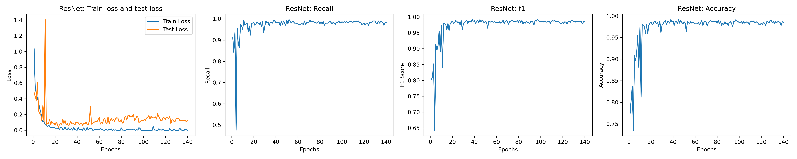
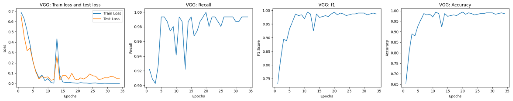

- Prediction of Newly Confirmed Cases of Covid19   https://github.com/mattxu98/Prediction-of-Newly-Confirmed-Cases-of-Covid19
- Marks Breakdown   https://github.com/mattxu98/GPA/blob/main/XU_LONGPENG_Marks_Breakdown.pdf

## Image Classification Neural Networks for Horizontal Brain MRI
- Built convolutional neural networks for accurate tumor recognition on RTX4070. Conducted dataset selection and image augmentation
- Trained ConvNet/DenseNet-121/ResNet-18 with early stopping, adjusted 4 types of parameters based on performances
- Realized transfer learning on VGG16, varying parameters: pre-trained frozen/pre-trained unfrozen/post-trained
- Results. DenseNet performed best on the data (recall 1, acc 0.99), ResNet was robust to all parameter sets (recall>=0.97). Pre-trained VGG was optimized (being generalized; recall 0.994 acc 0.987; only 34 epochs). SGD was the best optimizer

